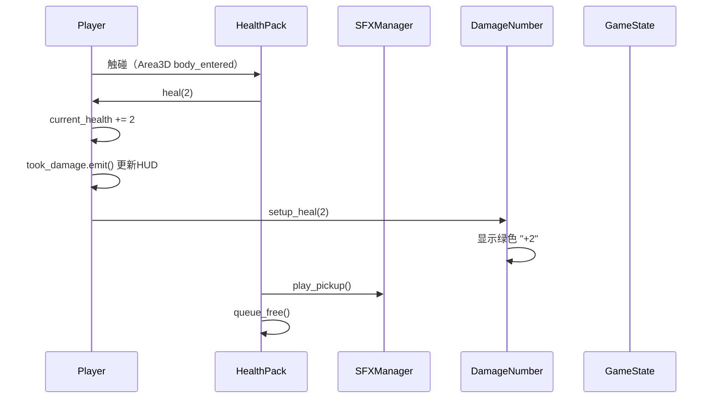
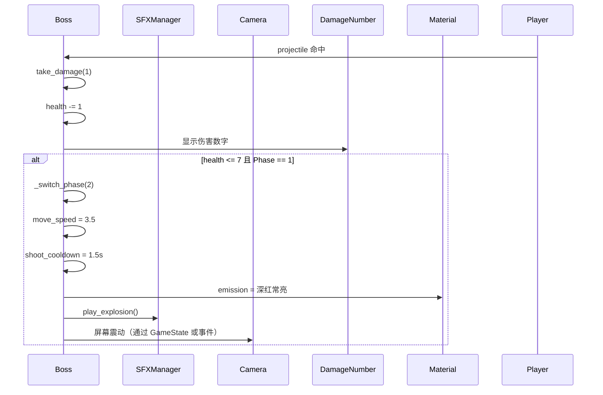
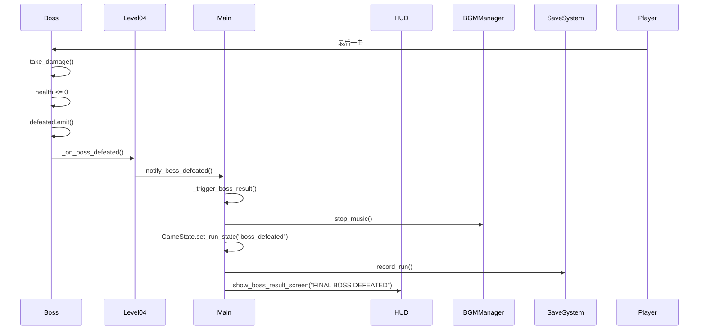

# Godot Game - Boss 关卡增量系统设计文档

> 版本：v1.0
> 日期：2026-05-03
> 作者：高见远（Architect）

---

## 1. 实现方案

### 1.1 Boss 敌人（`boss.gd` + `boss.tscn`）

**设计思路：**
- 继承 `CharacterBody3D`，参考 `enemy_shooter.gd` 的结构
- 实现两段式 Phase 系统，通过血量阈值（7 血）触发 Phase 切换
- 使用 `@export` 变量暴露配置项，方便在场景中调整
- Phase 切换时触发屏幕震动（`camera.add_shake()`）和爆炸音效（`SFX.play_explosion()`）
- Phase 2 时修改材质 emission 为深红色常亮

**核心机制：**
- **追击逻辑**：检测 `aggro_range`（15），追逐玩家
- **射击逻辑**：向玩家发射 projectile，射程 12，冷却时间随 Phase 变化
- **触碰伤害**：接触玩家造成 2 点伤害，冷却 1.2s
- **Phase 切换**：血量 ≤ 7 时自动切换，触发视觉/音效反馈

### 1.2 血包（`health_pack.gd` + `health_pack.tscn`）

**设计思路：**
- 使用 `Area3D` + `CollisionShape3D` 检测玩家触碰
- 胶囊体模型（`CapsuleMesh`）+ 红色发光材质（emission）
- 添加旋转动画（`_process` 中旋转）和浮动动画（`sin` 波实现上下浮动）
- 触碰时调用 `player.heal(2)`，播放拾取音效，然后 `queue_free()`

### 1.3 Level 04 关卡（`level_04.tscn` + `level_04.gd`）

**设计思路：**
- 25×25 的战斗竞技场，无出口区域
- 包含：2 巡逻 + 1 射击 + 1 跳跃 + 1 Boss
- 3 个血包分布在战场关键位置
- Boss 被击败后直接触发结算，显示 "FINAL BOSS DEFEATED"
- 继承 `level_01.gd` 的基础结构，重写 `_on_boss_defeated()` 逻辑

### 1.4 main.gd 修改

**修改要点：**
- `_level_scenes` 字典添加 Level 04
- 新增 `_on_boss_defeated()` 方法处理 Boss 死亡事件
- 修改 `_on_player_reached_exit()` 逻辑，区分普通关卡和 Boss 关卡
- 新增 Boss 关卡结算路径，显示专属结算画面

### 1.5 player.gd 修改

**修改要点：**
- 新增 `heal(amount)` 方法，恢复生命值（不超过 `max_health`）
- 拾取血包时调用此方法

### 1.6 sfx_manager.gd 修改

**修改要点：**
- 新增 `play_pickup()` 方法，生成 8-bit 风格拾取音效

### 1.7 damage_number.gd 修改

**修改要点：**
- 修改 `setup()` 方法，支持可选的自定义颜色参数
- 血包拾取时显示绿色 "+2" 伤害数字

---

## 2. 文件列表

### 新建文件

| 文件路径 | 说明 |
|---------|------|
| `res://scripts/boss.gd` | Boss 敌人逻辑脚本 |
| `res://scenes/entities/boss.tscn` | Boss 场景文件 |
| `res://scripts/health_pack.gd` | 血包逻辑脚本 |
| `res://scenes/entities/health_pack.tscn` | 血包场景文件 |
| `res://scripts/level_04.gd` | Level 04 关卡脚本 |
| `res://scenes/levels/level_04.tscn` | Level 04 场景文件 |

### 修改文件

| 文件路径 | 说明 |
|---------|------|
| `res://scripts/main.gd` | 添加 Level 04 支持，Boss 结算逻辑 |
| `res://scripts/player.gd` | 新增 `heal()` 方法 |
| `res://scripts/sfx_manager.gd` | 新增 `play_pickup()` 方法 |
| `res://scripts/damage_number.gd` | 支持自定义颜色参数 |
| `res://scenes/levels/level_01.tscn` | 添加 2 个血包实例 |
| `res://scenes/levels/level_02.tscn` | 添加 2 个血包实例 |
| `res://scenes/levels/level_03.tscn` | 添加 2 个血包实例 |

---

## 3. 关键数据结构和接口

### 3.1 Boss 类（`boss.gd`）

```gdscript
extends CharacterBody3D

signal defeated
signal phase_changed(new_phase)  # new_phase: 1 或 2

# 基础属性
@export var max_health: int = 12
@export var move_speed_phase1: float = 2.0
@export var move_speed_phase2: float = 3.5
@export var shoot_cooldown_phase1: float = 2.5
@export var shoot_cooldown_phase2: float = 1.5
@export var aggro_range: float = 15.0
@export var shoot_range: float = 12.0
@export var touch_damage: int = 2
@export var touch_cooldown: float = 1.2
@export var phase_threshold: int = 7  # Phase 2 触发阈值

# 内部状态
var current_health: int
var _current_phase: int = 1
var _target = null
var _dead: bool = false
var _touch_timer: float = 0.0
var _shoot_timer: float = 0.0
var _model_root: Node3D
var _mesh_instance: MeshInstance3D

# 方法
func _ready() -> void
func _physics_process(delta: float) -> void
func take_damage(amount: int) -> void
func _switch_phase(new_phase: int) -> void
func _shoot_at_target() -> void
func _try_touch_target() -> void
func _flash_hit() -> void
func _spawn_damage_number(amount: int, is_heal: bool = false) -> void
```

### 3.2 血包类（`health_pack.gd`）

```gdscript
extends Area3D

signal picked_up

@export var heal_amount: int = 2
@export var rotation_speed: float = 90.0  # 度/秒
@export var float_amplitude: float = 0.3
@export var float_speed: float = 2.0

var _time: float = 0.0
var _base_y: float = 0.0

# 方法
func _ready() -> void
func _process(delta: float) -> void
func _on_body_entered(body: Node) -> void
```

### 3.3 Player 新增方法（`player.gd`）

```gdscript
# 新增方法
func heal(amount: int) -> void:
	"""恢复生命值，不超过 max_health"""
	if current_health >= max_health:
		return
	current_health = min(current_health + amount, max_health)
	took_damage.emit(current_health, max_health)  # 复用伤害信号通知 HUD
	SFX.play_pickup()
	_spawn_heal_number(amount)

func _spawn_heal_number(amount: int) -> void:
	"""显示绿色治疗数字"""
	var dn := _damage_number_scene.instantiate()
	get_tree().current_scene.add_child(dn)
	dn.global_position = global_position + Vector3(0, 1.2, 0)
	dn.setup_heal(amount)  # 新增方法
```

### 3.4 damage_number.gd 修改

```gdscript
# 修改后
func setup(amount: int, is_player: bool = false, custom_color: Color = Color.TRANSPARENT) -> void:
	label.text = str(amount)
	if custom_color != Color.TRANSPARENT:
		label.modulate = custom_color
	elif is_player:
		label.modulate = Color(1.0, 0.3, 0.2, 1.0)
	else:
		label.modulate = Color(1.0, 0.85, 0.3, 1.0)

# 新增方法
func setup_heal(amount: int) -> void:
	label.text = "+" + str(amount)
	label.modulate = Color(0.2, 0.9, 0.3, 1.0)  # 绿色
```

### 3.5 SFXManager 新增方法

```gdscript
func play_pickup() -> void:
	var player := _get_available_player()
	player.stream = _generate_tone(800.0, 0.08, 0.3)
	player.play()
```

### 3.6 Level 04 脚本（`level_04.gd`）

```gdscript
extends Node3D

signal boss_defeated

@onready var boss_node = $Boss

func _ready() -> void:
	if boss_node and boss_node.has_method("connect"):
		boss_node.defeated.connect(_on_boss_defeated)

func _on_boss_defeated() -> void:
	boss_defeated.emit()
	# 通知 main.gd
	var main = get_tree().current_scene
	if main != null and main.has_method("notify_boss_defeated"):
		main.notify_boss_defeated()
```

### 3.7 main.gd 新增/修改接口

```gdscript
# 修改 _level_scenes
var _level_scenes: Dictionary = {
	1: preload("res://scenes/levels/level_01.tscn"),
	2: preload("res://scenes/levels/level_02.tscn"),
	3: preload("res://scenes/levels/level_03.tscn"),
	4: preload("res://scenes/levels/level_04.tscn")  # 新增
}

# 新增方法
func notify_boss_defeated() -> void:
	"""Boss 被击败，触发专属结算"""
	_enemy_count = 0
	_kill_count += 1
	_trigger_boss_result()

func _trigger_boss_result() -> void:
	"""Boss 关卡专属结算"""
	if _result_shown:
		return
	_result_shown = true
	BGM.stop_music()
	GameState.set_run_state("boss_defeated")
	_hide_game_hud()
	
	var elapsed: float = Time.get_ticks_msec() / 1000.0 - _start_time
	SaveSystem.record_run(_kill_count, elapsed, true)
	
	screen_transition.fade_out(0.3)
	await screen_transition.transition_finished
	hud.show_boss_result_screen("FINAL BOSS DEFEATED", _kill_count, _total_enemies, _get_elapsed_time())
```

---

## 4. 程序调用流程

### 4.1 血包拾取流程



### 4.2 Boss Phase 切换流程



### 4.3 Boss 死亡→结算流程



---

## 5. Boss 场景节点结构

参考 `enemy_patroller.tscn` 和 `enemy_shooter.tscn` 的节点树结构：

```
Boss (CharacterBody3D)
├── CollisionShape3D          # 碰撞体
├── ModelRoot (Node3D)        # 模型根节点
│   ├── Body (MeshInstance3D) # 主体（橙色/深红色材质）
│   ├── Head (MeshInstance3D) # 头部
│   ├── ArmL (MeshInstance3D) # 左臂
│   ├── ArmR (MeshInstance3D) # 右臂
│   └── Gun (MeshInstance3D)  # 武器
├── Muzzle (Marker3D)         # 枪口射击点
├── AggroZone (Area3D)        # 追击范围检测
│   └── CollisionShape3D
├── ShootZone (Area3D)        # 射击范围检测（可选）
│   └── CollisionShape3D
├── TouchZone (Area3D)        # 触碰伤害检测
│   └── CollisionShape3D
└── HealthBar (Node3D)        # 血条（可选，参考敌人设计）
```

**材质配置：**
- Phase 1：albedo_color = Color(1.0, 0.5, 0.2)（橙色），emission 不启用
- Phase 2：albedo_color = Color(0.8, 0.2, 0.1)（深红），emission_enabled = true，emission = Color(0.9, 0.1, 0.1)，emission_energy_multiplier = 1.5（常亮）

**Scale：1.8×**（整体缩放）

---

## 6. Level 04 场景节点结构

```
Level04 (Node3D)  # 脚本: level_04.gd
├── Ground (StaticBody3D)
│   ├── CollisionShape3D (25×25)
│   └── MeshInstance3D
├── BackWall (StaticBody3D)
├── FrontWall (StaticBody3D)
├── LeftWall (StaticBody3D)
├── RightWall (StaticBody3D)
├── PillarA/B/C/D (StaticBody3D)  # 战场装饰/障碍物
├── CrateA~F (StaticBody3D)       # 可破坏/可躲避的箱子
├── EnemyPatroller1 (instance: enemy_patroller.tscn)
├── EnemyPatroller2 (instance: enemy_patroller.tscn)
├── EnemyShooter1 (instance: enemy_shooter.tscn)
├── EnemyJumper1 (instance: enemy_jumper.tscn)
├── Boss (instance: boss.tscn)    # Boss 节点
├── HealthPack1 (instance: health_pack.tscn)
├── HealthPack2 (instance: health_pack.tscn)
├── HealthPack3 (instance: health_pack.tscn)
├── PlayerSpawn (Marker3D)        # 玩家出生点
└── SpawnBeacon (Node3D)          # 出生点指示
```

**关键参数：**
- 场景尺寸：25×25 单位
- 无 ExitZone（无出口）
- Boss 位置：建议放在场景中心偏后位置
- 血包分布：分散在战场各个角落，鼓励玩家移动

---

## 7. main.gd 修改要点

### 7.1 添加 Level 04 到关卡字典

```gdscript
func _ready() -> void:
	GameState.reset_run()
	_level_scenes = {
		1: preload("res://scenes/levels/level_01.tscn"),
		2: preload("res://scenes/levels/level_02.tscn"),
		3: preload("res://scenes/levels/level_03.tscn"),
		4: preload("res://scenes/levels/level_04.tscn")  # 新增
	}
	_current_level = 1
	# ...
```

### 7.2 添加 Boss 关卡判定

```gdscript
func _is_boss_level() -> bool:
	return _current_level == 4
```

### 7.3 修改 _bind_level 添加 Boss 信号连接

```gdscript
func _bind_level() -> void:
	# ... 原有逻辑 ...
	
	# Boss 关卡特殊绑定
	if _is_boss_level() and level.has_method("notify_boss_defeated"):
		if level.has_signal("boss_defeated"):
			level.boss_defeated.connect(_on_boss_defeated)
```

### 7.4 添加 Boss 结算处理方法

```gdscript
func _on_boss_defeated() -> void:
	notify_boss_defeated()

func notify_boss_defeated() -> void:
	if _result_shown:
		return
	_result_shown = true
	
	BGM.stop_music()
	GameState.set_run_state("boss_defeated")
	GameState.set_story_line("FINAL BOSS DEFEATED")
	_hide_game_hud()
	
	var elapsed: float = Time.get_ticks_msec() / 1000.0 - _start_time
	SaveSystem.record_run(_kill_count, elapsed, true)
	
	# 检查成就
	var new_achievements: Array = Achievements.check_achievements(
		_kill_count, _total_enemies, elapsed, true, _hp_lost
	)
	if new_achievements.size() > 0:
		hud.show_achievement_unlocks(new_achievements)
	
	screen_transition.fade_out(0.5)
	await screen_transition.transition_finished
	hud.show_boss_result_screen("FINAL BOSS DEFEATED", _kill_count, _total_enemies, _get_elapsed_time())
```

### 7.5 修改 _on_player_reached_exit 处理 Boss 关卡

```gdscript
func _on_player_reached_exit() -> void:
	# Boss 关卡无出口，不应触发此方法
	if _is_boss_level():
		return
	
	# ... 原有逻辑 ...
```

### 7.6 添加 Boss 结算画面支持（HUD）

需要在 `hud.gd` 中添加：

```gdscript
func show_boss_result_screen(message: String, kills: int, total: int, time: String) -> void:
	# 显示 Boss 击败专属结算画面
	# 可以复用 show_result_screen 但使用不同样式
	result_title.text = message
	result_kills.text = "Kills: %d / %d" % [kills, total]
	result_time.text = "Time: %s" % time
	result_screen.visible = true
```

---

## 8. 待明确事项

### 8.1 当前已明确
- ✅ Boss 血量 12，两段式 Phase（12~7，6~1）
- ✅ Boss Scale 1.8×
- ✅ 血包 +2 HP，红色发光胶囊体
- ✅ Level 04 尺寸 25×25
- ✅ Boss 击败显示 "FINAL BOSS DEFEATED"

### 8.2 需要进一步确认
1. **Boss 模型细节**：是否需要专属 3D 模型，还是复用现有敌人模型放大 + 换色？
2. **屏幕震动实现**：Godot 中屏幕震动是通过 Camera3D 的 `shake_offset` 还是其他方式？需要确认 `player.gd` 中是否已有震动接口可复用。
3. **Boss 射击 Projectile**：是否复用现有 `projectile.tscn`，还是需要新的 Boss 专属弹幕？
4. **Level 01~03 血包位置**：具体放在每个关卡的什么位置？
5. **Boss BGM**：是否需要专属 BGM？`bgm_manager.gd` 是否需要添加 `play_boss_music()`？
6. **成就系统**：Boss 首通是否需要新增专属成就？
7. **存档系统**：Boss 关卡通关后是否需要标记游戏通关（可能影响 Title 画面显示）？

### 8.3 技术风险
1. **Boss Phase 切换性能**：同时触发多个 Tween 动画（材质修改、缩放、音效）是否会影响性能？
2. **多敌人场景性能**：Level 04 包含 5 个敌人 + Boss，需确认性能表现。
3. **信号连接生命周期**：Boss 死亡后 `queue_free()`，信号连接是否需要手动断开？

---

## 9. 附录：关键代码片段参考

### 9.1 Boss Phase 切换实现参考

```gdscript
func take_damage(amount: int = 1) -> void:
	if _dead:
		return
	current_health -= amount
	_spawn_damage_number(amount)
	
	# Phase 切换检测
	if current_health <= phase_threshold and _current_phase == 1:
		_switch_phase(2)
	
	if current_health <= 0:
		_dead = true
		defeated.emit()
		SFX.play_enemy_death()
		_death_animation()
	else:
		SFX.play_enemy_hurt()
		_flash_hit()

func _switch_phase(new_phase: int) -> void:
	_current_phase = new_phase
	phase_changed.emit(new_phase)
	
	if new_phase == 2:
		# 修改移动速度和射击冷却
		# 注意：这里需要修改导出变量，实际在 _physics_process 中读取
		# 或者通过 set_deferred 修改
		
		# 切换材质为深红常亮
		if _model_root:
			for child in _model_root.get_children():
				if child is MeshInstance3D and child.material_override:
					var mat = child.material_override as StandardMaterial3D
					if mat:
						mat.albedo_color = Color(0.8, 0.2, 0.1)
						mat.emission_enabled = true
						mat.emission = Color(0.9, 0.1, 0.1)
						mat.emission_energy_multiplier = 1.5
		
		# 屏幕震动 + 爆炸音效
		SFX.play_explosion()
		# TODO: 触发屏幕震动（需要 Camera 引用或信号）
		
		# 通知 HUD/GameState
		GameState.set_story_line("Boss enraged! Speed and fire rate increased!")
```

### 9.2 血包旋转+浮动动画实现

```gdscript
func _ready() -> void:
	body_entered.connect(_on_body_entered)
	_base_y = global_position.y

func _process(delta: float) -> void:
	# 旋转
	rotate_y(deg_to_rad(rotation_speed * delta))
	
	# 浮动
	_time += delta
	var new_y = _base_y + sin(_time * float_speed) * float_amplitude
	global_position.y = new_y
```

---

**文档结束**
