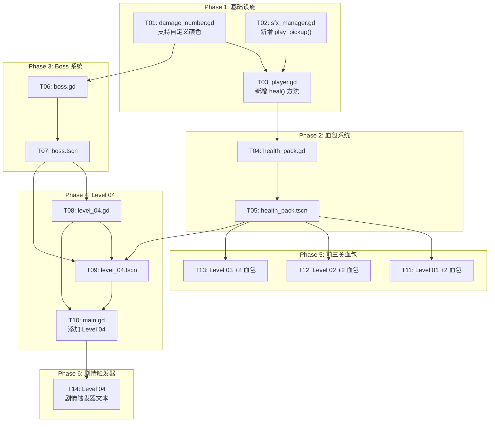

# Boss 关卡系统 - 任务列表文档

> 版本：v1.0
> 日期：2026-05-03
> 作者：毕达成（项目经理）
> 基于：系统设计文档（架构师高见远）

---

## 1. Required Packages

无额外依赖。使用 Godot 4.x 内置节点和系统：

- `CharacterBody3D` - Boss 和敌人基类
- `Area3D` - 血包碰撞检测、Boss 范围检测
- `CollisionShape3D` / `CapsuleShape3D` / `SphereShape3D` - 碰撞体
- `MeshInstance3D` / `CapsuleMesh` / `BoxMesh` - 3D 模型
- `Marker3D` - 射击点标记
- `Node3D` - 层级根节点
- `StaticBody3D` - 地面和墙壁
- `Label3D` - 伤害数字显示
- `Tween` - 动画效果

---

## 2. Logic Analysis

### 2.1 新建文件

#### `res://scripts/boss.gd`
两段式 Boss 敌人脚本，核心逻辑：
- 继承 `CharacterBody3D`，参考 `enemy_shooter.gd` 结构
- `max_health = 12`，Phase 1（12~7血）速度2.0/射击2.5s，Phase 2（6~1血）速度3.5/射击1.5s
- 追击玩家（aggro_range=15），射程12，触碰伤害2点（冷却1.2s）
- Phase 切换时触发：材质变深红常亮、爆炸音效、屏幕震动（通过 `add_shake()`）
- `defeated` 信号 + `phase_changed(new_phase)` 信号
- 复用 `enemy_shooter.gd` 的射击逻辑

#### `res://scenes/entities/boss.tscn`
Boss 场景文件，节点结构：
```
Boss (CharacterBody3D) [script: boss.gd]
├── CollisionShape3D (CapsuleShape3D radius=0.5, height=1.2)
├── ModelRoot (Node3D)
│   ├── Torso (MeshInstance3D) [BoxMesh 0.5×0.6×0.3, 橙色材质]
│   ├── Head (MeshInstance3D) [SphereMesh, 橙色材质]
│   ├── Visor (MeshInstance3D) [发光黄色护目镜]
│   ├── ArmL/ArmR (MeshInstance3D)
│   └── LegL/LegR (MeshInstance3D)
├── Muzzle (Marker3D)
├── AggroZone (Area3D) [SphereShape3D radius=15]
└── TouchZone (Area3D) [SphereShape3D radius=1.2]
```
- 整体 scale: 1.8×（场景中设置）
- Phase 1 材质：橙色 `Color(1.0, 0.5, 0.2)`
- Phase 2 材质：深红 `Color(0.8, 0.2, 0.1)` + emission 常亮

#### `res://scripts/health_pack.gd`
血包拾取逻辑：
- 继承 `Area3D`
- `heal_amount = 2`，触碰时调用 `player.heal(2)`
- 播放 `SFX.play_pickup()`
- `queue_free()` 销毁

#### `res://scenes/entities/health_pack.tscn`
血包场景文件：
```
HealthPack (Area3D) [script: health_pack.gd]
├── CollisionShape3D (CapsuleShape3D radius=0.25, height=0.6)
├── MeshInstance3D (CapsuleMesh, 红色发光材质)
└── CollisionShape3D (same capsule, 碰撞检测)
```
- 红色发光材质：`albedo_color = Color(0.9, 0.15, 0.15)`，`emission = Color(0.9, 0.1, 0.1)`，`emission_energy_multiplier = 2.0`
- 动画：Y轴旋转90°/s + sin波浮动0.3振幅

#### `res://scripts/level_04.gd`
Level 04 关卡脚本：
- 继承基础关卡逻辑（无 `extends`，独立脚本）
- `boss_defeated` 信号
- 连接 Boss 的 `defeated` 信号，触发 `notify_boss_defeated()` 通知 main.gd
- **无 ExitZone**（Boss 关卡无出口）
- 剧情触发器支持（2段文本）

#### `res://scenes/levels/level_04.tscn`
Level 04 场景文件：
- 尺寸：25×25 单位
- 地面 + 4面墙 + 若干掩体
- 敌人：2×Patroller + 1×Shooter + 1×Jumper + 1×Boss
- 3个血包分布在战场
- PlayerSpawn 标记
- 2个 StoryTrigger（剧情触发器）

### 2.2 修改文件

#### `res://scripts/main.gd`
**Diff：**
```diff
 _level_scenes = {
     1: preload("res://scenes/levels/level_01.tscn"),
     2: preload("res://scenes/levels/level_02.tscn"),
-    3: preload("res://scenes/levels/level_03.tscn")
+    3: preload("res://scenes/levels/level_03.tscn"),
+    4: preload("res://scenes/levels/level_04.tscn")
 }
```
- 新增 `notify_boss_defeated()` 方法
- 新增 `_on_boss_defeated()` 方法（信号回调）
- 新增 `_is_boss_level()` 辅助方法
- 修改 `_bind_level()` 添加 Boss 信号连接
- 修改 `_on_player_reached_exit()` 处理 Boss 关卡（无出口，直接 return）
- `_start_game()` 中添加 Level 04 剧情文本

#### `res://scripts/player.gd`
**Diff：**
```diff
+func heal(amount: int) -> void:
+    """恢复生命值，不超过 max_health"""
+    if current_health >= max_health:
+        return
+    current_health = min(current_health + amount, max_health)
+    took_damage.emit(current_health, max_health)
+    SFX.play_pickup()
+    _spawn_heal_number(amount)
+
+func _spawn_heal_number(amount: int) -> void:
+    """显示绿色治疗数字"""
+    var dn := _damage_number_scene.instantiate()
+    get_tree().current_scene.add_child(dn)
+    dn.global_position = global_position + Vector3(0, 1.2, 0)
+    dn.setup(amount, true, Color(0.2, 0.9, 0.3, 1.0))
```

#### `res://scripts/sfx_manager.gd`
**Diff：**
```diff
+func play_pickup() -> void:
+    var player := _get_available_player()
+    player.stream = _generate_tone(800.0, 0.08, 0.3)
+    player.play()
```

#### `res://scripts/damage_number.gd`
**Diff：**
```diff
-func setup(amount: int, is_player: bool = false) -> void:
+func setup(amount: int, is_player: bool = false, custom_color: Color = Color.TRANSPARENT) -> void:
     label.text = str(amount)
-    if is_player:
-        label.modulate = Color(1.0, 0.3, 0.2, 1.0)
-    else:
-        label.modulate = Color(1.0, 0.85, 0.3, 1.0)
+    if custom_color != Color.TRANSPARENT:
+        label.modulate = custom_color
+    elif is_player:
+        label.modulate = Color(1.0, 0.3, 0.2, 1.0)
+    else:
+        label.modulate = Color(1.0, 0.85, 0.3, 1.0)
```

#### `res://scenes/levels/level_01.tscn`
添加 2 个血包实例（复用 `health_pack.tscn`）：
- HealthPackA：位置 `(6, 0.6, 3)`
- HealthPackB：位置 `(-6, 0.6, -6)`

#### `res://scenes/levels/level_02.tscn`
添加 2 个血包实例：
- HealthPackA：位置 `(5, 0.6, 4)`
- HealthPackB：位置 `(-5, 0.6, -5)`

#### `res://scenes/levels/level_03.tscn`
添加 2 个血包实例：
- HealthPackA：位置 `(7, 0.6, 5)`
- HealthPackB：位置 `(-7, 0.6, -7)`

---

## 3. 有序任务拆分

### Phase 1: 基础设施（无依赖）

| 任务ID | 描述 | 涉及文件 | 依赖 | 验收标准 |
|--------|------|----------|------|----------|
| T01 | 修改 `damage_number.gd` 支持自定义颜色 | `scripts/damage_number.gd` | 无 | `setup(amount, is_player, custom_color)` 支持传入 `Color` 参数，绿色 "+2" 正确显示 |
| T02 | 修改 `sfx_manager.gd` 新增 `play_pickup()` | `scripts/sfx_manager.gd` | 无 | `play_pickup()` 方法存在，生成 800Hz 短促音效 |
| T03 | 修改 `player.gd` 新增 `heal()` 方法 | `scripts/player.gd` | T02 | `heal(2)` 可恢复 HP，显示绿色治疗数字，调用 `SFX.play_pickup()` |

### Phase 2: 血包系统

| 任务ID | 描述 | 涉及文件 | 依赖 | 验收标准 |
|--------|------|----------|------|----------|
| T04 | 创建 `health_pack.gd` 脚本 | `scripts/health_pack.gd` | T03 | Area3D 碰撞检测，触碰玩家调用 `player.heal(2)`，`queue_free()` 销毁 |
| T05 | 创建 `health_pack.tscn` 场景 | `scenes/entities/health_pack.tscn` | T04 | 红色发光胶囊体，旋转+浮动动画正常 |

### Phase 3: Boss 系统

| 任务ID | 描述 | 涉及文件 | 依赖 | 验收标准 |
|--------|------|----------|------|----------|
| T06 | 创建 `boss.gd` 脚本 | `scripts/boss.gd` | T01 | 两段式 Phase（12~7 / 6~1），速度/射击冷却切换，Phase 2 材质变深红，`defeated` 信号 |
| T07 | 创建 `boss.tscn` 场景 | `scenes/entities/boss.tscn` | T06 | 节点结构正确，材质配置正确，scale=1.8 |

### Phase 4: Level 04 关卡

| 任务ID | 描述 | 涉及文件 | 依赖 | 验收标准 |
|--------|------|----------|------|----------|
| T08 | 创建 `level_04.gd` 脚本 | `scripts/level_04.gd` | T06, T07 | Boss defeated 信号连接，`notify_boss_defeated()` 正确调用 |
| T09 | 创建 `level_04.tscn` 场景 | `scenes/levels/level_04.tscn` | T05, T07, T08 | 25×25 尺寸，5敌人+Boss，3血包，无 ExitZone |
| T10 | 修改 `main.gd` 添加 Level 04 支持 | `scripts/main.gd` | T08 | 四关流程完整，Boss 击败显示 "FINAL BOSS DEFEATED" |

### Phase 5: 前三关血包补充

| 任务ID | 描述 | 涉及文件 | 依赖 | 验收标准 |
|--------|------|----------|------|----------|
| T11 | Level 01 添加 2 个血包 | `scenes/levels/level_01.tscn` | T05 | 2个血包实例位置合理，动画正常 |
| T12 | Level 02 添加 2 个血包 | `scenes/levels/level_02.tscn` | T05 | 2个血包实例位置合理，动画正常 |
| T13 | Level 03 添加 2 个血包 | `scenes/levels/level_03.tscn` | T05 | 2个血包实例位置合理，动画正常 |

### Phase 6: Level 04 剧情触发器

| 任务ID | 描述 | 涉及文件 | 依赖 | 验收标准 |
|--------|------|----------|------|----------|
| T14 | Level 04 添加 2 段剧情文本 | `scripts/level_04.gd`, `scripts/main.gd` | T10 | 剧情文本在 main.gd 中正确配置，触发器工作正常 |

---

## 4. Full API Spec

### 4.1 boss.gd

```gdscript
extends CharacterBody3D

signal defeated
signal phase_changed(new_phase: int)

# 导出配置
@export var max_health: int = 12
@export var move_speed_phase1: float = 2.0
@export var move_speed_phase2: float = 3.5
@export var shoot_cooldown_phase1: float = 2.5
@export var shoot_cooldown_phase2: float = 1.5
@export var aggro_range: float = 15.0
@export var shoot_range: float = 12.0
@export var touch_damage: int = 2
@export var touch_cooldown: float = 1.2
@export var phase_threshold: int = 7

# 方法
func _ready() -> void
    # 初始化：获取玩家引用，添加到 enemies 组，设置初始状态

func _physics_process(delta: float) -> void
    # 追击逻辑、射击逻辑、触碰伤害检测

func take_damage(amount: int) -> void
    # 处理受伤，检测 Phase 切换，死亡处理

func _switch_phase(new_phase: int) -> void
    # Phase 2 切换：修改速度、射击冷却、材质、触发音效和屏幕震动

func _shoot_at_target() -> void
    # 向目标发射投射物，复用 enemy_shooter.gd 逻辑

func _try_touch_target() -> void
    # 触碰范围内造成伤害

func _flash_hit() -> void
    # 受伤闪白效果

func _spawn_damage_number(amount: int) -> void
    # 显示伤害数字

func _death_animation() -> void
    # 死亡动画：缩小 + 材质发光 + queue_free()
```

### 4.2 health_pack.gd

```gdscript
extends Area3D

signal picked_up

@export var heal_amount: int = 2
@export var rotation_speed: float = 90.0  # 度/秒
@export var float_amplitude: float = 0.3
@export var float_speed: float = 2.0

var _time: float = 0.0
var _base_y: float = 0.0

func _ready() -> void
    # 连接 body_entered 信号，记录初始 Y 坐标

func _process(delta: float) -> void
    # Y 轴旋转 + sin 波浮动

func _on_body_entered(body: Node) -> void
    # 触碰玩家：调用 player.heal(heal_amount)，播放音效，销毁
```

### 4.3 level_04.gd

```gdscript
extends Node3D  # 无 extends，独立脚本

signal boss_defeated

@onready var boss_node = $Boss

func _ready() -> void
    # 连接 boss.defeated 信号

func _on_boss_defeated() -> void
    # 触发 boss_defeated 信号
    # 调用 main.notify_boss_defeated()
```

### 4.4 player.gd 新增方法

```gdscript
func heal(amount: int) -> void
    """
    恢复生命值，不超过 max_health
    @param amount: 恢复量
    """
    if current_health >= max_health:
        return
    current_health = min(current_health + amount, max_health)
    took_damage.emit(current_health, max_health)  # 复用信号更新 HUD
    SFX.play_pickup()
    _spawn_heal_number(amount)

func _spawn_heal_number(amount: int) -> void
    """显示绿色治疗数字"""
    var dn := _damage_number_scene.instantiate()
    get_tree().current_scene.add_child(dn)
    dn.global_position = global_position + Vector3(0, 1.2, 0)
    dn.setup(amount, true, Color(0.2, 0.9, 0.3, 1.0))
```

### 4.5 damage_number.gd 修改

```gdscript
func setup(amount: int, is_player: bool = false, custom_color: Color = Color.TRANSPARENT) -> void
    """
    初始化伤害数字
    @param amount: 数值
    @param is_player: 是否是玩家受伤（红色 vs 黄色）
    @param custom_color: 自定义颜色（优先于此参数）
    """
```

### 4.6 sfx_manager.gd 新增方法

```gdscript
func play_pickup() -> void
    """播放拾取音效：800Hz 短促音调"""
```

### 4.7 main.gd 新增/修改方法

```gdscript
func _is_boss_level() -> bool
    """判断是否为 Boss 关卡"""
    return _current_level == 4

func _bind_level() -> void
    # 修改：添加 Boss 关卡信号连接
    if _is_boss_level() and level.has_signal("boss_defeated"):
        level.boss_defeated.connect(_on_boss_defeated)

func _on_boss_defeated() -> void
    """Boss 被击败信号回调"""
    notify_boss_defeated()

func notify_boss_defeated() -> void
    """Boss 击败处理：Boss 关卡专属结算"""
    if _result_shown:
        return
    _result_shown = true
    BGM.stop_music()
    GameState.set_run_state("boss_defeated")
    _hide_game_hud()
    var elapsed: float = Time.get_ticks_msec() / 1000.0 - _start_time
    SaveSystem.record_run(_kill_count, elapsed, true)
    # 检查成就...
    screen_transition.fade_out(0.5)
    await screen_transition.transition_finished
    hud.show_boss_result_screen("FINAL BOSS DEFEATED", _kill_count, _total_enemies, _get_elapsed_time())

func _on_player_reached_exit() -> void
    # 修改：Boss 关卡无出口，直接返回
    if _is_boss_level():
        return
    # ...原有逻辑...
```

---

## 5. Shared Knowledge

### 5.1 颜色值

| 元素 | albedo_color | emission | emission_energy |
|------|-------------|----------|-----------------|
| Boss Phase 1 | `Color(1.0, 0.5, 0.2)` | - | - |
| Boss Phase 2 | `Color(0.8, 0.2, 0.1)` | `Color(0.9, 0.1, 0.1)` | 1.5 |
| 血包 | `Color(0.9, 0.15, 0.15)` | `Color(0.9, 0.1, 0.1)` | 2.0 |
| 治疗数字 | - | - | - | `Color(0.2, 0.9, 0.3, 1.0)` 绿色 |

### 5.2 时间参数

| 参数 | 值 | 单位 |
|------|-----|------|
| Boss Phase 1 速度 | 2.0 | m/s |
| Boss Phase 2 速度 | 3.5 | m/s |
| Boss Phase 1 射击冷却 | 2.5 | s |
| Boss Phase 2 射击冷却 | 1.5 | s |
| Boss 追击范围 | 15.0 | m |
| Boss 射击射程 | 12.0 | m |
| Boss 触碰伤害 | 2 | HP |
| Boss 触碰冷却 | 1.2 | s |
| 血包治疗量 | 2 | HP |
| 血包旋转速度 | 90 | °/s |
| 血包浮动振幅 | 0.3 | m |
| 血包浮动频率 | 2.0 | Hz |

### 5.3 尺寸参数

| 元素 | 参数 |
|------|------|
| Level 04 尺寸 | 25×25 单位 |
| Boss Scale | 1.8× |
| Boss 碰撞体 | CapsuleShape3D radius=0.5, height=1.2 |
| 血包碰撞体 | CapsuleShape3D radius=0.25, height=0.6 |

### 5.4 关键阈值

| 事件 | 阈值 |
|------|------|
| Boss Phase 切换 | 血量 ≤ 7 |
| Boss 死亡 | 血量 ≤ 0 |
| 玩家满血时拾取血包 | 无效果（不触发拾取音效？） |

---

## 6. 任务依赖图



---

## 7. 验收检查清单

### T01-T03: 基础设施
- [ ] `damage_number.gd` `setup()` 支持 `custom_color` 参数
- [ ] `sfx_manager.gd` 存在 `play_pickup()` 方法
- [ ] `player.gd` 存在 `heal()` 方法，调用正确

### T04-T05: 血包系统
- [ ] 血包触碰玩家后正确调用 `player.heal(2)`
- [ ] 血包播放拾取音效后 `queue_free()`
- [ ] 血包旋转动画正常
- [ ] 血包浮动动画正常
- [ ] 血包红色发光材质正确

### T06-T07: Boss 系统
- [ ] Boss Phase 1（橙色）正确显示
- [ ] Boss Phase 2（深红常亮）正确切换
- [ ] Phase 2 速度提升至 3.5
- [ ] Phase 2 射击冷却缩短至 1.5s
- [ ] Phase 切换触发爆炸音效
- [ ] Boss 死亡触发 `defeated` 信号
- [ ] Boss 死亡动画正常

### T08-T10: Level 04
- [ ] Level 04 场景 25×25 尺寸正确
- [ ] 包含 2 Patrol + 1 Shooter + 1 Jumper + 1 Boss
- [ ] 包含 3 个血包
- [ ] 无 ExitZone
- [ ] Boss 击败后显示 "FINAL BOSS DEFEATED"
- [ ] 四关流程完整（1→2→3→4）

### T11-T13: 前三关血包
- [ ] Level 01 包含 2 个血包
- [ ] Level 02 包含 2 个血包
- [ ] Level 03 包含 2 个血包
- [ ] 所有血包动画正常

### T14: 剧情触发器
- [ ] Level 04 包含 2 个 StoryTrigger
- [ ] 剧情文本正确配置在 main.gd
- [ ] 触发器触发后显示正确文本

---

**文档结束**
